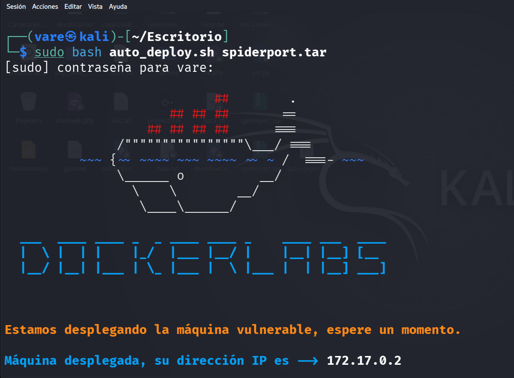
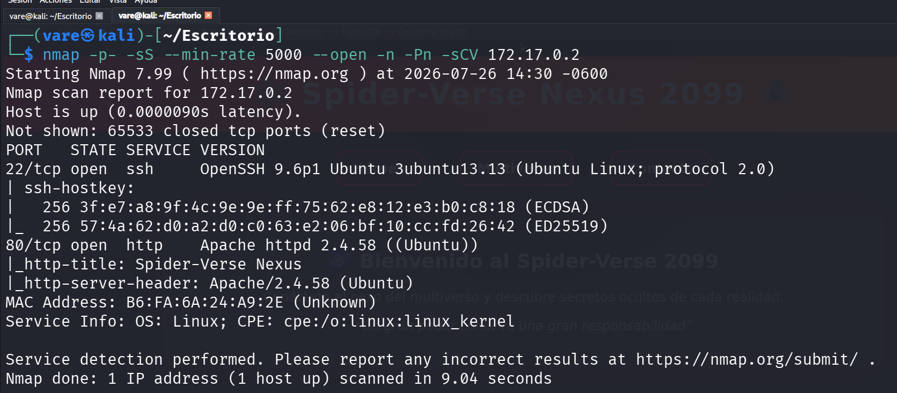
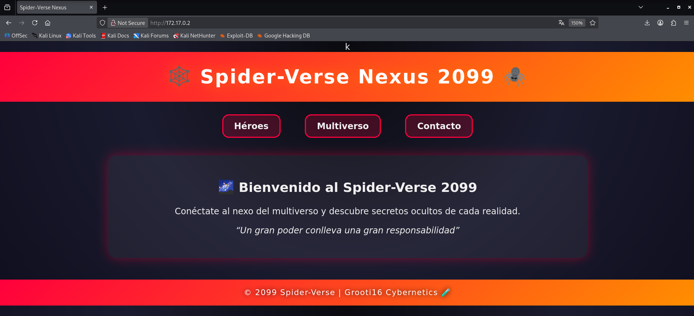
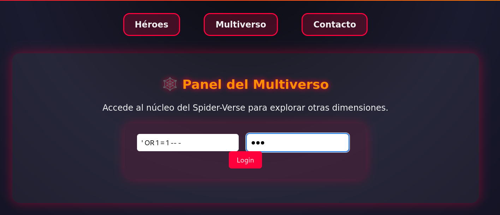
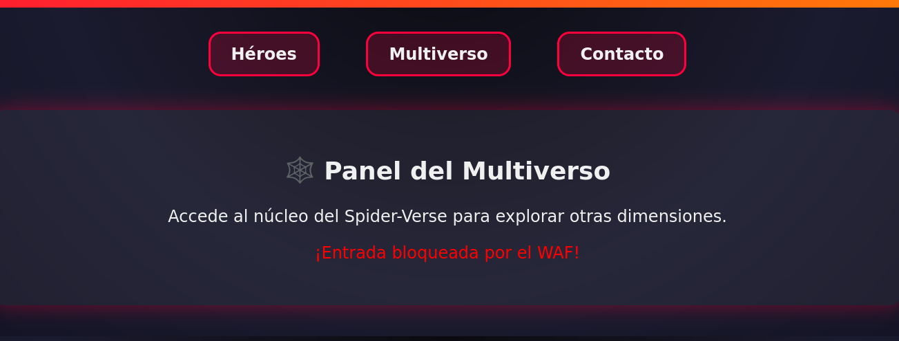
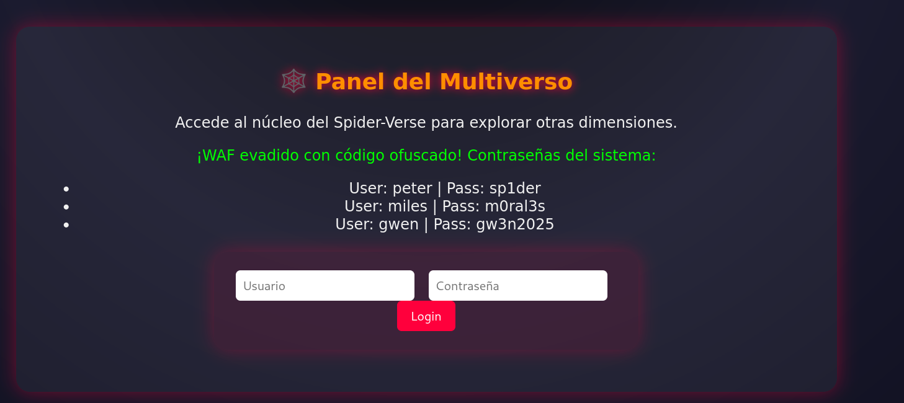
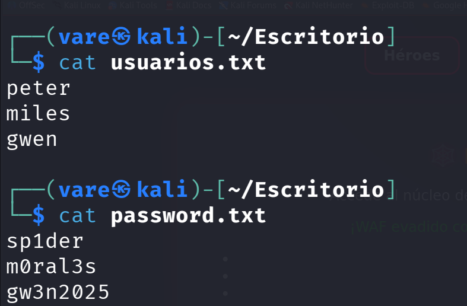
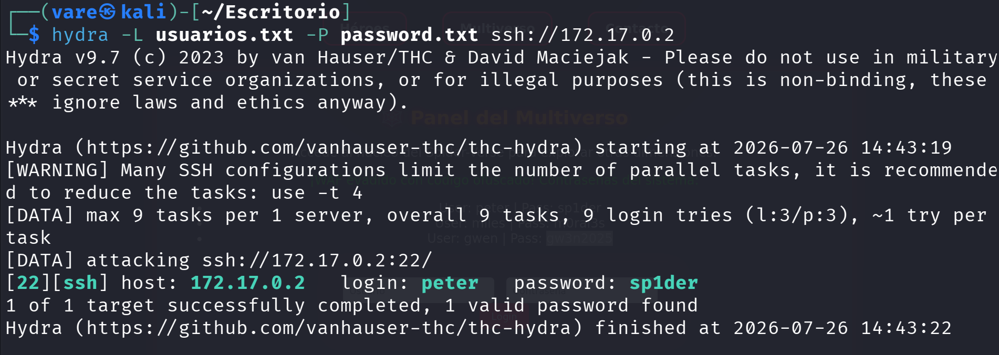
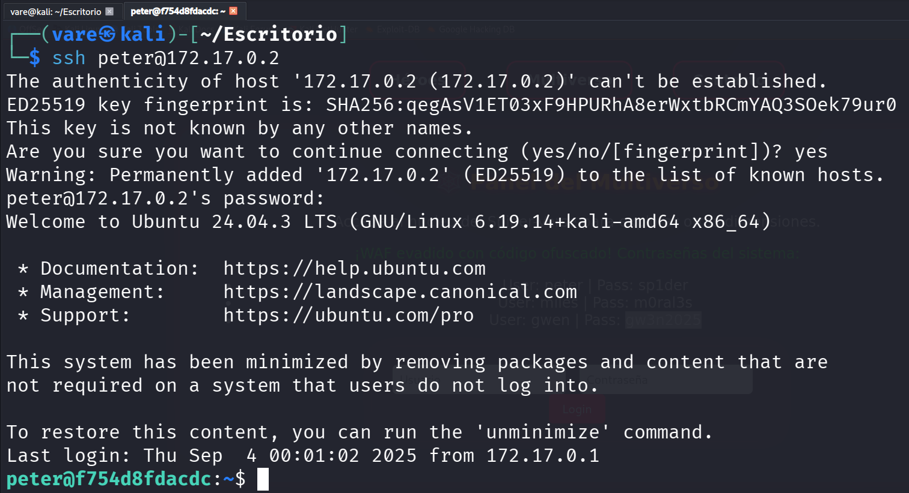

<h2>Desplegamos el laboratorio spiderport.tar</h2>

<h2>Realizamos un Reconocimiento de Nmap para conocer puertos abiertos y servicios activos</h2>

<h2>El laboratorio tiene dos puertos en funcionamiento</h2>
<li>Puerto 22</li>
<li>Puerto 80</li>

<h2>Entramos a la aplicacion web y nos encontramos con lo siguiente.</h2>

<h2>En la seleccion de Multiverso encontramos un panel de login por el cual intentaremos bypassear con el siguiente PAYLOAD</h2>
<h3> ' OR 1 = 1-- -</h3>

<h2>Vamos a intentar evadir el WAF con otros payloads el cual el que me funciono fue este: </h2>
<h3>` Query("select * from table where a=".$_GET['a']." and b=".$_GET['b']);</h3>

 

<h2>Ponemos el payload en el usuario y cualquier contraseña, y obtendremos las siguientes credenciales.</h2>

<h2>Guardamos los usuarios y contraseñas en un archivo txt</h2>

<h2>Realizamos un ataque de fuerza bruta con hydra y las credenciales correctas son estas: </h2>

<h2>Entramos por SSH</h2>

